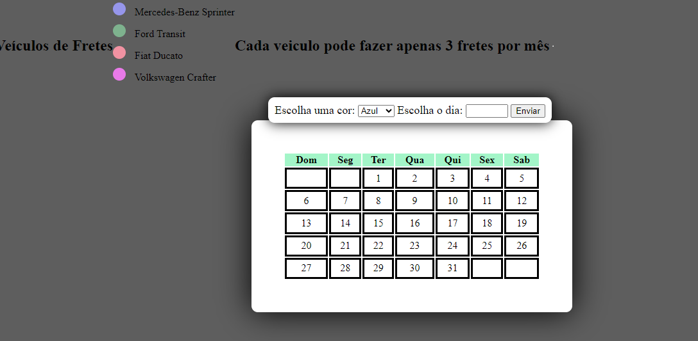

# calendario

# CONTEXTO DO PROBLEMA
 
A empresa Alpha está contratando estagiários para trabalhar na área de agendamento dos dos fretes contratos. Como você notou, trata-se de uma empresa de fretamento e a vaga é para ocupar uma área que ficará responsável por realizar os agendamentos. A regra de agendamento será a seguinte:
Existem 4 veículos para realização do frete;
Cada veículo será identificado por uma cor;
Um veículo não pode fazer mais de um frete no mesmo dia;
 
Você precisará montar uma solução que permita ao colaborador(a) da área registrar no calendário qual em qual dia um determinado veículo terá que realizar o frete.

 Este projeto foi proposto pelo Professor [Leonardo Santiago Sidon](https://github.com/LeonardoRochaMarista) 

# UTILIDADE
Este projeto foi feito para maximizar a eficiência operacional, melhorar o serviço ao cliente e impulsionar o crescimento dos negócios, com uma interface amigável, simplificando o a organização.
# Para desenvolver este projeto foi utilizado as linguagens
* JAVASCRIPT
* HTML5
* CSS3

Feito por: [Kaio Henrique Funari Correia](https://github.com/kaiohen)
